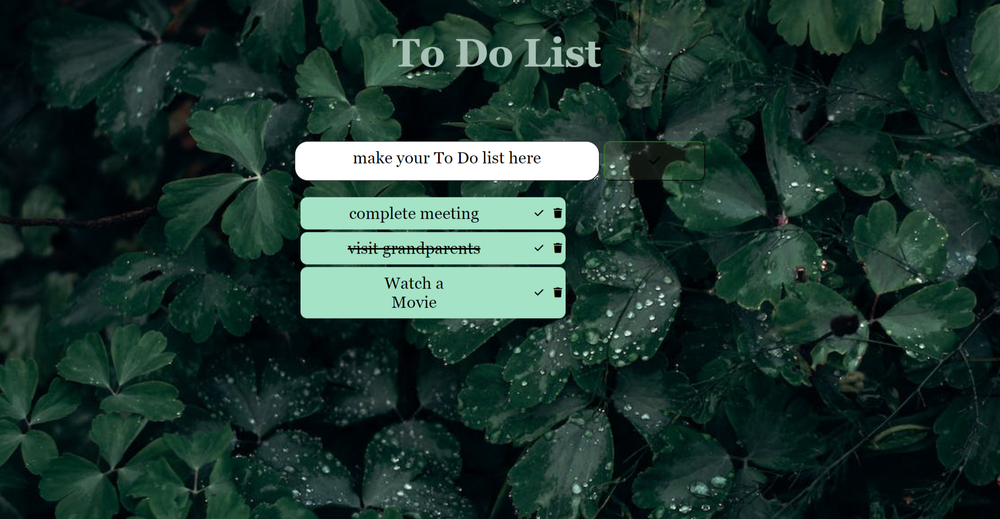

# To Do List Project

A simple "To Do List" project built using HTML, CSS, and JavaScript. Stay organized by adding, checking, and removing tasks from your list.

## Live Demo

Check out the live version of the "To Do List" project [here](https://mounikakuncha14.github.io/To-Do-List/).

## Table of Contents

- [Description](#description)
- [Features](#features)
- [JavaScript Functionality](#javascript-functionality)
- [Usage](#usage)
- [Installation](#installation)
- [Contributing](#contributing)
- [License](#license)

## Description

Stay organized with the "To Do List" project! This project provides a user-friendly interface to add tasks, mark them as completed, and remove them from the list.

## Features

- Add tasks to the list
- Mark tasks as completed
- Remove tasks from the list
- Responsive design with a stylish background image

## JavaScript Functionality

The JavaScript code in this project enables the following functionalities:

- Adding tasks to the list.
- Checking tasks as completed by clicking the checkmark button.
- Deleting tasks from the list by clicking the trash button.

## Usage

1. Enter a task in the input field.
2. Click the checkmark button to add the task to the list.
3. To mark a task as completed, click the checkbox next to it.
4. To remove a task, click the trash button next to it.
5. Enjoy staying organized with your tasks!

## Installation

No installation is required. Simply visit the [live version](https://mounikakuncha14.github.io/To-Do-List/) in your web browser.

## Contributing

Contributions are welcome! If you find any issues or have suggestions for improvements, feel free to submit a pull request.

Stay organized and manage your tasks effectively with the "To Do List" project!
